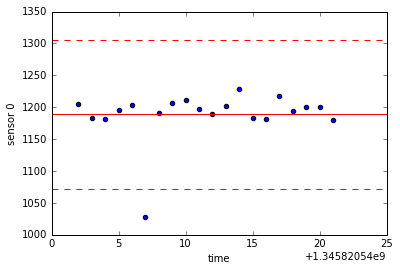

#  Ejercicio básico en Python 2.7

El programa `sensores.py` analiza un archivo de muestras de sensores, selecciona y lista los outliers y el tiempo de ocurrencia en hh:mm:ss. Además gráfica, para cada sensor, las mediciones, el promedio y la zona de aceptacion de 3 sigma de ancho.

Comando para ejecutar en consola:

> ```$ python sensores.py <sample_file>```

``samples.txt`` es un archivo de muestras que organiza en columnas el tiempo (seg) y dato de 3 sensores.

`test.txt` es un archivo de muestras reducido para hacer pruebas, tiene pocos datos y solo de 2 sensores.

*****

### Toolbox

|libraries|function| uso |
|---------: |:---- :|:---:|
|`numpy`   |np.where(`<condition for A>`) |lista de indices de elementos de A que cumplen condicion|          
|  |np.loadtxt(`<filename>`, unpack=True) |Extrae columnas como np.array de archivo de datos|
|`time`    |time.strtime("%H:%M:%S",time.gmtime(`<segundos>`)) |convierte segundos en hh:mm.ss|
|`sys`     |sys.argv |lista de argumentos de consola|


#### Print with format 

Example:

```python
print  '%s' % 'hola', '%7.2f' % 3.145685
``` 

## Vista de ejecución de programa


```python
# inside ipython notebook
%matplotlib inline
%run sensores.py test.txt
```

     
    Showing bad values from sensor 0
    15:02:27 1028.68
     
    Showing bad values from sensor 1
    15:02:37  882.17
     





```python
%run sensores.py samples.txt
```

     
    Showing bad values from sensor 0
    15:02:27 1168.68
    15:11:17 1170.28
    15:16:02 1232.00
    15:27:05 1169.78
    15:31:05 1167.57
    15:41:21 1230.66
    15:42:57 1169.78
    15:43:10 1169.48
    15:48:49 1237.11
    15:50:18 1167.22
     
    Showing bad values from sensor 1
    15:19:36  785.71
    15:19:45  786.83
    15:26:49  787.62
    15:32:11  812.66
    15:35:04  787.12
    15:38:07  812.49
    15:46:00  812.17
    15:47:57  812.28
    15:50:57  812.93
    15:52:28  787.24
     
    Showing bad values from sensor 2
    15:10:07  196.91
    15:11:46  203.20
    15:26:54  196.76
    15:28:15  196.89
    15:35:42  196.99
    15:50:55  196.95
    15:51:20  196.89
    15:56:48  196.74
    15:57:10  203.07
     


```python

```


```python

```
